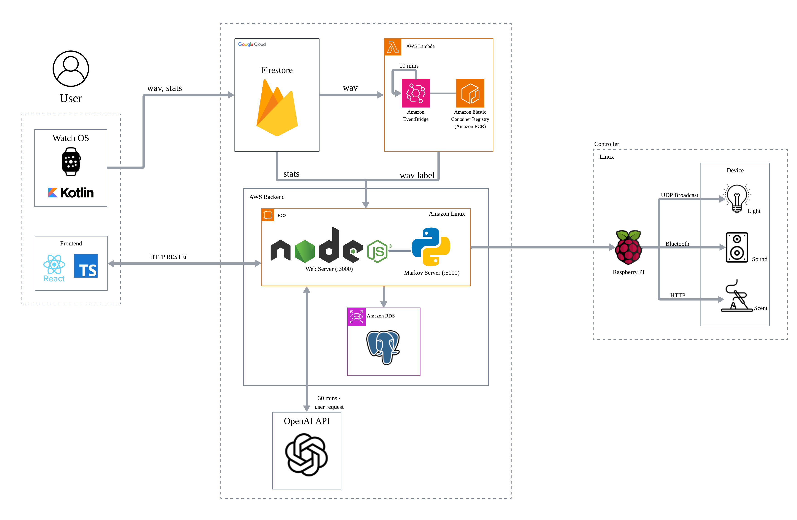

# Mood Manager

### AI-Based Personalized Mood Management System for Smart Homes

#### UI FLOW (Mock)
Sample page: [mood-manager-official](https://mood-manager-official.vercel.app/)

#### API Specification (v1)

Watch Repository: [mood-manager-watch](https://github.com/Ma-Hyekjin/mood-manager-watch.git)
API Docs: [Mood Manager – API Specification v1](https://www.notion.so/Mood-Manager-API-Specification-v1-2b1739c2f15880a0bafcfdc063069488)

-----

## Overview

**Mood Manager** is the core service that operates a virtual output device called the **Manager**, which is capable of producing and controlling lighting, scents, and sound within the simulated home environment. The entire system pipeline is designed under the assumption that this Manager device exists as the final output layer of the project.

The service analyzes biometric signals collected from the WearOS device (such as HRV and stress indicators), audio events (laughter/sigh/anger/sadness detection), user preferences, and external factors such as weather. Using these combined inputs, the system processes data through preprocessing and two-stage processing (emotion prediction + mood expansion) to generate personalized mood streams and drives the Manager device accordingly. Currently, emotion prediction uses LLM (P1-P3), with plans to replace it with a dedicated time-series + Markov chain model (P4) for improved consistency and performance. This platform was developed as part of the Hanyang University Software Engineering course in collaboration with LG Electronics, following the pipeline: **WearOS → Firebase → ML Analysis Server → Next.js WebApp → Emotion Prediction (LLM/ML Model) → Mood Expansion (LLM) → Production Deployment**.

## 소개

**무드매니저(Mood Manager)**는 WearOS 기기에서 수집된 생체 정보와 음성 이벤트를 기반으로 사용자의 심리·신체 상태를 분석하고, 이에 최적화된 조명·향기·소리 환경을 추천하는 멀티모달 AI 서비스입니다.

디바이스 'Manager'를 운용하는 핵심 서비스이며, Manager는 조명·향기·소리를 출력/제어하는 본 프로젝트의 가상 디바이스입니다. 본 프로젝트의 흐름은 해당 디바이스의 사용과 각종 스마트기기 연결을 전제로 합니다.

사용자의 생체 신호(HRV, 스트레스 지표, 수면 패턴), 음성 이벤트(웃음/한숨/분노/슬픔 감지), 개인 선호도, 그리고 날씨와 같은 외부 요인을 종합하여 개인화된 무드 상태를 추론합니다. 현재는 감정 예측에 LLM을 사용하나(P1-P3), 향후 전용 시계열+마르코프 체인 모델로 교체 예정(P4)입니다. **WearOS → Firebase → ML 분석 서버 → Next.js 웹앱 → 감정 예측 (LLM/ML 모델) → 무드 확장 (LLM)** 파이프라인을 기반으로 동작되도록 설계되었습니다.

-----

## System Architecture

### 1. WearOS Layer

  * **Kotlin-based native app:** An application optimized specifically for wearable devices.
  * **Health Services API:** Collects real-time heart rate, HRV indicators, stress metrics, and movement data.
  * **Audio processing:** Captures 2-second audio using AudioRecord, calculates RMS/dBFS to filter silent segments, and converts PCM audio into WAV/Base64.
  * **Foreground Service:** Maintains a stable 1-minute background loop to collect data continuously.
  * **Data Upload:** Sends collected biometric and audio data to user-specific collections in Firestore.

### 2. Firebase Layer

  * **Real-time data bridge:** Relays data between the wearable device, ML server, and Web App.
  * **Data structure:**
      * `users/{userId}/raw_periodic/{docId}` – biometric data  
      * `users/{userId}/raw_events/{docId}` – audio events (Base64 WAV)

### 3. ML Python Microservice

  * **Audio classification:** Retrieves Base64 WAV data stored in Firestore.
  * **Analysis:** Classifies events into laughter, sigh, anger, sadness, or false-positive (noise).
  * **Result delivery:** Sends validated classification results (timestamp + emotion type) back to the Web App.

### 4. Web Application Layer (Next.js)

  * **Data retrieval:** Receives biometric data and ML-classified audio events from Firestore.
  * **Preprocessing:** Converts biometric and audio data into valid numerical features and merges them with user preferences and external information such as weather.
  * **Mood Generation:** Two-stage processing for mood generation:
    - **Stage 1 (Emotion Prediction):** Generates 10 emotion segments (30 minutes) 
      - **Current (P1-P3):** LLM-based prediction (temperature: 0.3 for consistency)
      - **Target (P4):** Time-series + Markov chain model (replaces LLM for better consistency and performance)
    - **Stage 2 (Mood Expansion):** Expands emotion segments into detailed mood outputs with colors, music, scents, and lighting using LLM (temperature: 0.7 for creativity)
  * **Dashboard:** Visualizes the final inferred mood and simulates home environment control through the Manager device.

-----

## 시스템 아키텍처

### 1. WearOS 계층

  * **Kotlin 기반 네이티브 앱:** 웨어러블 기기에 최적화된 애플리케이션입니다.
  * **Health Services API:** 심박수, HRV, 스트레스 지표, 움직임 데이터를 실시간으로 수집합니다.
  * **오디오 처리:** AudioRecord를 통해 2초간 음성을 캡처하고, RMS/dBFS를 계산하여 무음 구간을 필터링한 뒤 PCM 데이터를 WAV/Base64로 변환합니다.
  * **포그라운드 서비스:** 1분 주기의 루프를 통해 백그라운드에서도 안정적으로 데이터를 수집합니다.
  * **데이터 업로드:** 수집된 생체 및 오디오 데이터를 Firestore의 사용자별 컬렉션에 업로드합니다.

### 2. Firebase 계층

  * **실시간 데이터 브릿지:** 웨어러블, ML 서버, 웹 앱 간의 데이터 흐름을 중계합니다.
  * **데이터 구조:**
      * `users/{userId}/raw_periodic/{docId}`: 생체 데이터
      * `users/{userId}/raw_events/{docId}`: 오디오 이벤트 (Base64 WAV)

### 3. ML Python 마이크로서비스

  * **오디오 분류:** Firestore에 저장된 Base64 WAV 데이터를 가져옵니다.
  * **분석:** 데이터를 웃음, 한숨, 분노, 슬픔, 오탐(소음)으로 분류합니다.
  * **결과 반환:** 검증된 이벤트 분류 결과(시간 + 한숨/웃음/분노/슬픔)를 웹 앱으로 전달합니다.

### 4. 웹 애플리케이션 계층 (Next.js)

  * **데이터 수집:** Firestore에서 생체 데이터와 ML 분류가 완료된 오디오 이벤트를 수신합니다.
  * **전처리:** 생체/음성 데이터를 유효한 수치형 데이터로 전처리합니다. 이후 사용자 선호도와 날씨 등 외부 데이터를 결합합니다.
  * **무드 생성:** 2단계 처리를 통한 무드 생성:
    - **1차 처리 (감정 예측):** 10개의 감정 세그먼트 생성 (30분)
      - **현재 (P1-P3):** LLM 기반 예측 (temperature: 0.3, 일관성 필수)
      - **목표 (P4):** 시계열 + 마르코프 체인 모델 (LLM 대체, 더 나은 일관성 및 성능)
    - **2차 처리 (무드 확장):** 감정 세그먼트를 색상, 음악, 향, 조명이 포함된 상세 무드 아웃풋으로 확장 (LLM 사용, temperature: 0.7, 창의성 필수)
  * **대시보드:** 최종 결정된 무드를 시각화하고 홈 환경 제어를 시뮬레이션합니다.
-----



-----

## Data Pipeline Structure

### WearOS Data Models

**1. `raw_periodic` (Biometric Data / 생체 데이터)**

```json
{
  "heart_rate_avg": "Average Heart Rate (bpm)",
  "heart_rate_max": "Max Heart Rate",
  "heart_rate_min": "Min Heart Rate",
  "hrv_sdnn": "Heart Rate Variability (Stress Indicator)",
  "movement_count": "Movement intensity",
  "respiratory_rate_avg": "Average Respiratory Rate",
  "is_fallback": "Boolean (True if sensor fails)",
  "timestamp": "Server Timestamp"
}
```

**2. `raw_events` (Audio Events / 오디오 이벤트)**

```json
{
  "audio_base64": "Encoded Audio Data (Nullable)",
  "event_dbfs": "Decibels relative to full scale",
  "event_duration_ms": "Duration of the event",
  "event_type_guess": "laughter | sigh | anger | sadness | unknown",
  "is_fallback": "Boolean",
  "timestamp": "Server Timestamp"
}
```

-----

## Web Application Structure

### Directory Map

```bash
mood-manager/
 ├── Web/                       # Web Application (Next.js)
 │   ├── src/                   # Source Code
 │   │   ├── app/               # Next.js App Router
 │   │   │   ├── (auth)/        # Authentication Routes
 │   │   │   ├── (main)/        # Protected Routes
 │   │   │   └── api/           # API Routes
 │   │   ├── components/        # Shared Components
 │   │   ├── lib/               # Utilities & Configurations
 │   │   ├── hooks/             # Custom React Hooks
 │   │   └── types/             # TypeScript Type Definitions
 │   ├── public/                # Static Assets (includes system-architecture.png)
 │   ├── prisma/                # Prisma Schema & Migrations
 │   ├── .build-artifacts/      # Build artifacts (auto-generated, git-ignored)
 │   ├── package.json           # Dependencies (Next.js requires root)
 │   ├── tsconfig.json          # TypeScript Configuration (Next.js requires root)
 │   └── [config files]        # next.config.ts, eslint.config.mjs, etc. (Next.js requires root)
 ├── Watch/                     # WearOS Application
 ├── ML/                        # ML Python Server
 ├── docs/                      # Documentation
 │   ├── README.md             # Documentation index
 │   ├── API_SPECIFICATION.md  # API Specification
 │   ├── PROJECT_STRUCTURE.md  # Project structure guide
 │   ├── SETUP_GUIDE.md        # Installation and setup guide
 │   └── REFACTORING_PLAN.md   # Refactoring plan
 └── README.md                  # Project Overview
```

### Key Features

  * **Login System:** Email/Password authentication with rate limiting (5 failed attempts → 15min lock), enter-to-submit support, session-based access control, and social login (Google, Kakao, Naver). Forgot password functionality with email-based reset link. Supports mock/real API switching.
  * **Registration System:** Complete registration form with Family Name, Name, Date of Birth, Gender fields. Real-time validation with visual feedback (email format, password strength, password match). Auto-formatting for date input (yyyy.mm.dd). Automatic session creation and redirect to home page.
  * **Survey Flow:** Initial user preference collection via popup overlay on home page (skippable). Defaults are applied if skipped. Survey status checked on home page load.
  * **Home Dashboard:** Displays the inferred mood stream (10 segments, 30 minutes), offering environment presets and a device control grid (2×N expandable cards). Full device management (add, delete, power toggle, scent interval control). Real-time mood stream visualization with segment selection.
  * **Mood Management:** Complete mood control system with full change, scent change, song change, and color change capabilities. Real-time device state updates. Mood stream refresh and segment replacement functionality.
  * **Mood Set Page:** Displays saved mood segments in a 2×4 grid (8 cards per page) with pagination. Each card shows mood alias, music, and scent with mood color background. Delete and replace segment functionality with confirmation modals.
  * **My Page:** User profile information, Q&A, 1:1 inquiry, privacy policy, and account deletion with confirmation.
  * **Admin Mode:** Special login mode (`admin@moodmanager.com` / `admin1234`) for full UI flow testing with mock data. Supports mock device creation/deletion and localStorage-based mood set management.
  * **API System:** All API routes implemented with mock responses and admin mode support. Ready for backend integration (code commented, ready to uncomment).

-----

## Features & Roadmap

### **P1 – Environment Setup & Core Pipeline**

  * [x] Next.js + Tailwind Project Initialization
  * [x] WearOS Project Configuration
  * [x] Firestore Database Structure Design (`users/{uid}/raw_periodic`, `users/{uid}/raw_events`)
  * [x] WearOS ForegroundService Implementation
  * [x] Health Services Integration (HR, HRV, Stress monitoring)
  * [x] Audio Pipeline (AudioRecord → WAV → Base64)
  * [x] Firestore Upload Pipeline Completion
  * [x] WebApp App Router Structure Setup
  * [x] Login Page & Session Management Implementation
  * [x] Registration Page Implementation (Family Name, Name, Date of Birth, Gender fields)
  * [x] Email & Password Validation with Visual Feedback
  * [x] Rate Limiting for Login (5 failed attempts → 15min lock)
  * [x] Social Login Integration (Google, Kakao, Naver via NextAuth)
  * [x] Forgot Password Functionality (Email-based reset link)
  * [x] My Page Implementation (Profile, Q&A, 1:1 Inquiry, Privacy Policy, Account Deletion)
  * [x] API Routes Structure Complete (Auth, Devices, Moods, Inquiry)
  * [x] Mock System Implementation (Frontend & API Routes)
  * [x] Project Structure Refactoring (Web/, Watch/, ML/, docs/ structure)
  * [x] Admin Mode Implementation (Mock data flow with real LLM calls)
  * [x] Mood Set Page (2×4 grid, pagination, delete/replace functionality)

### **P2 – Data Integration & Mood Pipeline**

  * [x] `raw_periodic` Data Stabilization
  * [x] `raw_events` Data Stabilization & DB Schema Finalization
  * [ ] ML Python Server Setup (Base64 WAV → Laughter/Sigh/Anger/Sadness Classification)
  * [ ] ML Server Data Retrieval Pipeline
  * [ ] ML Result Integration with WebApp
  * [x] WebApp Data Preprocessing (Biometric + ML Results + Preferences + Weather)
  * [ ] LLM Stage 1 Implementation (Time-series + Markov chain prediction for emotion segment generation)
  * [ ] LLM Stage 2 Implementation (Expand emotion segments into detailed mood outputs)
  * [x] Survey UI & Preference Storage Logic (SurveyOverlay component, home page popup, double-click preference selection)
  * [x] Home Dashboard v1 (Mood Stream Display with 10 segments, Lighting/Scent/Sound Indicators, segment selection)
  * [x] Device Management System (Add, Delete, Power Toggle, Scent Interval Control, confirmation modals)
  * [x] Mood Management System (Full Change, Scent Change, Song Change, Color Change, stream refresh)
  * [x] Mood Set Page (2×4 grid layout, pagination, mood color backgrounds, delete/replace with confirmation)
  * [x] My Page System (Profile, Q&A, 1:1 Inquiry, Privacy Policy, Account Deletion)
  * [x] Admin Mode (Mock device/mood management, localStorage-based persistence)
  * [x] API Routes Implementation (All endpoints with mock responses and admin mode support)
  * [x] Backend API Integration Preparation (All routes ready for backend connection)

### **P3 – Enhancement & Release**

  * [x] Mock System Complete (Frontend & API Routes)
  * [x] API Validation Complete (All endpoints verified)
  * [x] Responsive Design Implementation (375px width optimized)
  * [x] Admin Mode Complete (Full UI flow testing with mock data)
  * [x] Mood Set Management (Save, delete, replace segments with confirmation)
  * [ ] UI Polish & Mood Library Expansion
  * [ ] Device Simulation Upgrades
  * [ ] Backend Server Integration (Replace mock with real API calls)

### **P4 – Production Deployment & Advanced ML Integration**

  * [ ] Time-series + Markov Chain Model Implementation
    - [ ] Time-series analysis for emotion prediction
    - [ ] Markov chain state transition matrix implementation
    - [ ] Integration with LLM Stage 1 (replace LLM-based prediction)
    - [ ] Model training and validation pipeline
  * [ ] Data Flow Transition Complete
    - [ ] LLM Stage 1 Processing (Time-series + Markov chain based emotion segment generation)
    - [ ] LLM Stage 2 Processing (Emotion segments to detailed mood outputs)
    - [ ] Full pipeline testing (Preprocessing → ML Model → LLM Stage 1 → LLM Stage 2)
  * [ ] Production Web Application Deployment
    - [ ] AWS Amplify Deployment Configuration
    - [ ] Environment Variables Setup (Production)
    - [ ] Database Migration (Production)
    - [ ] CDN Configuration for Static Assets
    - [ ] Monitoring and Logging Setup
  * [ ] End-to-End Testing
    - [ ] WearOS → Firestore → ML Server → WebApp → LLM 2-stage processing
    - [ ] Real-time data flow validation
    - [ ] Performance testing and optimization
    - [ ] User acceptance testing (UAT)

-----

## Getting Started

### Requirements

- **Node.js**: 18.x or higher (recommended: 22.21.0)
- **npm**: 8.x or higher (recommended: 10.9.4)

**Check Node.js version**:
```bash
node --version
```

**If using nvm** (`.nvmrc` file is included in the `Web/` directory):
```bash
cd Web
nvm use
```

### Installation and Setup

1. **Navigate to the Web directory and install dependencies:**

    ```bash
    cd Web
    npm install
    ```

2. **Configure environment variables:**

    Create a `.env.local` file in the `Web/` directory and add the following:

    ```env
    NEXTAUTH_URL=http://localhost:3000
    NEXTAUTH_SECRET=your-secret-key-here
    ```

    For detailed environment variable configuration, refer to `docs/SETUP_GUIDE.md`.

    **Note**: All commands should be run from the `Web/` directory:
    ```bash
    cd Web
    npm install
    ```

3. **Run the development server:**

    ```bash
    cd Web
    npm run dev
    ```

    You can access the application at `http://localhost:3000` in your browser.

### Detailed Setup Guide

For detailed installation instructions, troubleshooting, and version information, refer to **[docs/SETUP_GUIDE.md](./docs/SETUP_GUIDE.md)**.

**Important**: After cloning the repository, navigate to the `Web/` directory before running installation commands.

-----

## Backend Integration Guide

### Overview

The frontend Next.js API routes act as a proxy to the backend server. All API routes are prepared with mock responses and can be switched to real backend calls by uncommenting the backend integration code.

### Environment Variables

```env
BACKEND_URL=http://localhost:8000
# or
NEXT_PUBLIC_BACKEND_URL=http://localhost:8000
```

### Backend API Endpoints Required

The backend server should implement the following APIs (see `docs/API_SPECIFICATION.md` for detailed specifications):

- **Authentication APIs**: Register, Login, Survey Status, Survey Submit, Survey Skip, Forgot Password, Profile, Account Deletion
- **Device Management APIs**: List, Create, Delete, Power Toggle, Scent Interval
- **Mood Management APIs**: Get Current, Update Full, Update Scent, Update Song, Update Color
- **Inquiry APIs**: Submit 1:1 Inquiry

### Session Management

- NextAuth sessions are managed via cookies
- Cookies are automatically forwarded to the backend server
- Alternatively, JWT tokens can be used via Authorization header

### Switching from Mock to Real API

1. Set `BACKEND_URL` environment variable
2. Uncomment backend integration code in API route files
3. Remove mock response code
4. Test API connectivity


-----

## Documentation

For detailed documentation, refer to the `docs/` directory.

### Key Documents
- `docs/API_SPECIFICATION.md` - Complete API specification (21 endpoints)
- `docs/PROJECT_STRUCTURE.md` - Project structure guide
- `docs/SETUP_GUIDE.md` - Installation and setup guide
- `docs/REFACTORING_PLAN.md` - Refactoring plan and future work

For the complete document list, refer to `docs/README.md`.

-----

## Team

| Name (KOR) | Name (ENG) | Department | Email |
| :--- | :--- | :--- | :--- |
| 마혁진 | Hyeokjin Ma | Information Systems | tema0311@hanyang.ac.kr |
| 박새연 | Saeyeon Park | Information Systems | saeyeon0317@hanyang.ac.kr |
| 안준성 | Junseong Ahn | Information Systems | lljs1113@hanyang.ac.kr |
| 채희주 | Heejoo Chae | Information Systems | heeju0203@hanyang.ac.kr |
| 최현우 | Hyeonwoo Choi | Information Systems | hhyyrr0713@hanyang.ac.kr |
